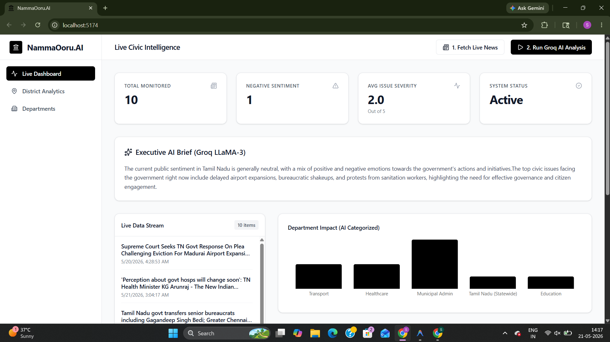

# NammaOoru.AI

An enterprise-grade, serverless AI platform that monitors real-time public sentiment, government-related discussions, and district intelligence across Tamil Nadu.



Web : https://namma-ooru-ai-adf4-rjfaht8kb.vercel.app/
## 🚀 Architecture: What we built 

To make this platform incredibly fast, free, and deployable within minutes, we used a **Live Serverless GenAI Architecture**.

1. **Live Data Fetching:** We use the `rss2json` API to bypass browser CORS restrictions and fetch live Google News headlines natively from the React app.
2. **Groq LLaMA-3 Engine:** Instead of a traditional backend, the React app directly connects to Groq's API. We use the `llama-3.1-8b-instant` model, which processes text at 800+ tokens per second.
3. **Strict JSON Segregation:** We prompt LLaMA-3 to act as a strict Civic Intelligence engine. It takes the unstructured headlines and forces them into a clean JSON array, dynamically extracting the exact District, Department, Sentiment, and Severity.
4. **Live Dashboard Rendering:** The moment the JSON is returned (usually <2 seconds), React automatically populates the Recharts graphs and Data Tables.

## 🛠️ Tech Stack

- **Frontend:** React.js (Vite)
- **Styling:** TailwindCSS v4 + Lucide Icons (Minimal Black & White "SaaS" Aesthetic)
- **Charting:** Recharts
- **AI Engine:** Groq API (LLaMA-3.1 8B Instant)
- **Data Source:** Google News 

## 💻 How to Run Locally

1. Open your terminal and navigate to the `frontend` folder:
   ```bash
   cd frontend
   ```
2. Install dependencies:
   ```bash
   npm install
   ```
3. Add your Groq API Key:
   - Open `.env.local` inside the `frontend` folder.
   - Add your key: `VITE_GROQ_API_KEY="gsk_..."`
4. Start the server:
   ```bash
   npm run dev
   ```
5. Open `http://localhost:5173` in your browser.

